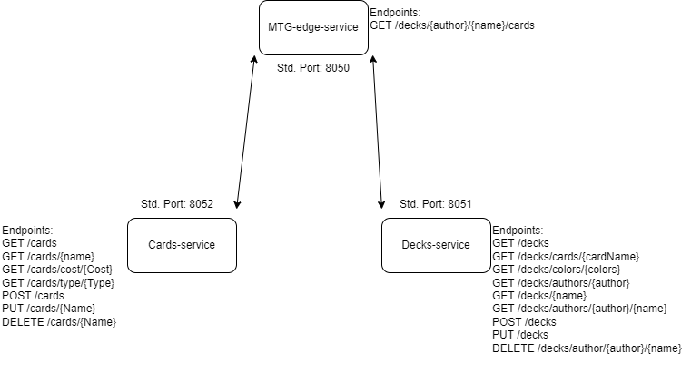

Het thema van onze applicatie is Magic The Gathering decks.

Onze twee microservices zijn Cards en Decks

Cards bevat specifieke info over kaarten (naam, cost, type): 

https://github.com/RaphaelVandenBergh/APT-MTG-Cards

Decks bevat info over decklists (naam, author, lijst met kaarten, colors): 

https://github.com/Brentvds12/APT-MTG-decks

